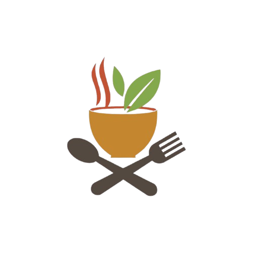
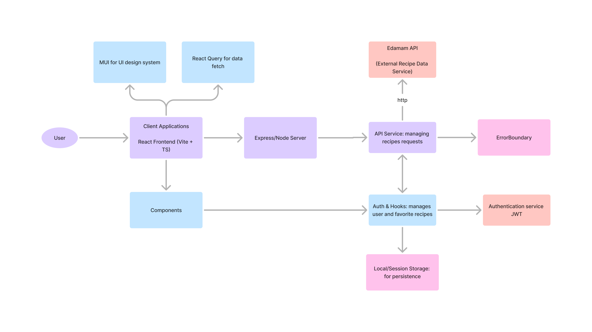

[](https://www.typescriptlang.org/)
[](https://jestjs.io/)
[](https://www.npmjs.com/package/prettier)
[](https://github.com/Ozziekins/ozzies-recipe-app/actions)
[](https://app.netlify.com/sites/ozzies-recipe-app/deploys)

<br />

<!-- PROJECT LOGO -->
<p align="center">
  <a href="https://github.com/Ozziekins/ozzies-recipe-app">
    
  </a>
</p>

<h1 align="center">Ozzie's Recipe App</h1>

<p align="center">
  A delightful cooking recipe web app, built with React, TypeScript, and Material UI. Explore a variety of recipes, favorite them, and share your culinary journey!
  <br />
  <a href="https://github.com/Ozziekins/ozzies-recipe-app#readme"><strong>Explore the docs »</strong></a>
  <br />
  <br />
  <a href="mailto:nenubariozioma@gmail.com">Contact 📧</a>
  ·
  <a href="https://ozzies-recipe-app.netlify.app/">Demo 👀</a>
</p>

---

<details open="open">
  <summary>Table of Contents 📑</summary>
  <ol>
    <li><a href="#description">Description</a></li>
    <li><a href="#features">Features</a></li>
    <li><a href="#technologies-used">Technologies Used</a></li>
    <li>
      <a href="#getting-started">Getting Started</a>
      <ul>
        <li><a href="#prerequisites">Prerequisites</a></li>
        <li><a href="#installing">Installing</a></li>
      </ul>
    </li>
    <li><a href="#usage">Usage</a></li>
    <li><a href="#ci--cd">CI & CD</a></li>
    <li><a href="#architecture-diagram">Architecture Diagram</a></li>
    <li><a href="#license">License</a></li>
    <li><a href="#acknowledgments">Acknowledgments</a></li>
  </ol>
</details>

---

## Description
Ozzie's Recipe App is a simple and intuitive cooking recipe platform. Users can explore a variety of dishes, search recipes, see a featured recipe, add favorites, and view personal favorites in their profile. Built with **React** and **TypeScript**, styled with **Material UI**, and powered by **Edamam** for recipe data.

> **Note:** This project showcases both **client-side** and **server-side** code (using an Express backend), as well as advanced features like **React Query** with Suspense, **Error Boundaries**, and **AuthContext** for user management.

---

## Features
- **Featured Recipe Banner**: Showcases a highlighted recipe each week.
- **Recipe Search & Listing**: Explore random or specific recipes from Edamam's API.
- **Favorite Recipes**: Mark recipes as favorites and see them in your profile.
- **Responsive UI**: Built with Material UI for a consistent, responsive design.
- **Suspense & Error Handling**: Client-side data fetching with Suspense and custom Error Boundaries.

---

## Technologies Used
- **React + TypeScript** (Vite)
- **Express** (Node.js server)
- **Material UI** (Design system & UI components)
- **React Query** (Data fetching & caching)
- **Edamam API** (External recipe data)
- **GitHub Actions** (CI)
- **Netlify** or **Vercel** (CD)

---

## Getting Started

### Prerequisites
- **Node.js** (v18 or later recommended)
- **npm** or **yarn**

### Installing
1. **Clone the repository**
   ```bash
   git clone https://github.com/Ozziekins/ozzies-recipe-app.git
   ```
2. **Navigate to project directory**
   ```bash
   cd ozzies-recipe-app
   ```
3. **Install dependencies**
   ```bash
   npm install
   ```
4. **Create a `.env` file** (if needed) with your Edamam credentials:
   ```bash
   EDAMAM_APP_ID=xxxxxx
   EDAMAM_APP_KEY=xxxxxx
   PORT=3003
   ```
5. **Run the development server**  
   In one terminal:
   ```bash
   npm run server
   ```
   In another terminal:
   ```bash
   npm run client
   ```
   or run both at once:
   ```bash
   npm run dev
   ```
   The frontend is served at `http://localhost:5173` (by default), and the Express server runs on `http://localhost:3003`.

---

## Usage
1. **Open** your browser at `http://localhost:5173`.
2. **Home Page**: Showcases a featured recipe, an About section, and a button to view all recipes.
3. **All Recipes**: Displays random or searched recipes. Click a card to see details.
4. **Recipe Details**: Includes images, ingredients, nutrition info, and a favorite icon.
5. **User Profile**: Lists your favorite recipes (requires basic AuthContext usage or a mock user).
6. **Enjoy** discovering new meals and saving them for later!

---

## CI & CD
This project uses **GitHub Actions** for Continuous Integration. On each push or pull request to `main`:
- **Linting** with ESLint
- **Typechecking** with `tsc`
- **Build** with `vite build`

For CD, you can deploy to:
- **Netlify** (example netlify badge above) or
- **Vercel** (Next or static deployments)
- or any platform of your choice.

---

## Architecture Diagram
Below is a simplified architecture of how the pieces fit together:



---

## License
This project is licensed under the MIT License - see the [LICENSE.md](LICENSE) file for details.

---

## Acknowledgments
- **Edamam** for providing the recipe data API
- **React Query** & **Material UI** communities for excellent docs and libraries
- Everyone who has contributed feedback to make this recipe app more delightful 🍳

---

Made with ❤️ by [Ozzie](mailto:nenubariozioma@gmail.com). Enjoy cooking!
